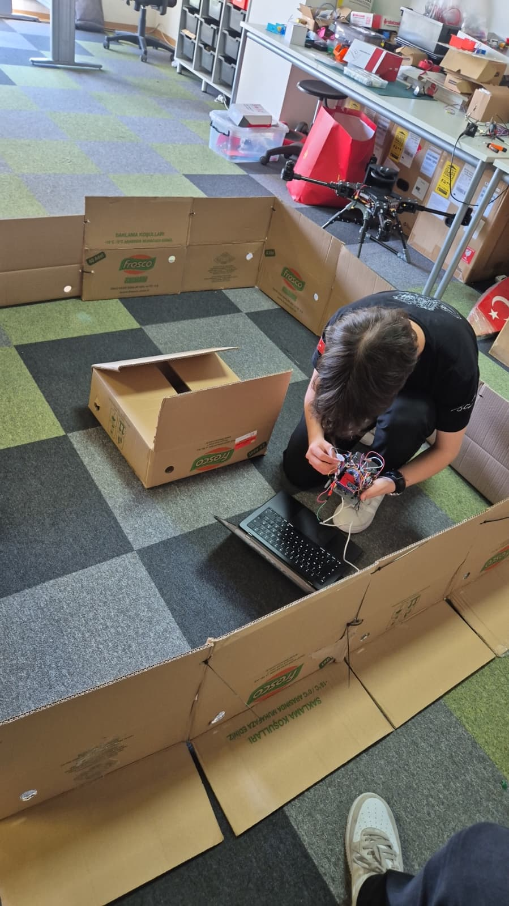

# WRO 2026 Future Engineers - CYBERRCORE

This repository contains Team CYBERRCORE's autonomous vehicle documentation for WRO 2026 Future Engineers. It is organized so judges can reproduce the robot's mechanical design, electronics architecture, and software behavior from the files in this repository.

## Robot Documentation Preview

| Mechanical CAD | Electronics Wiring |
| --- | --- |
|  |  |

| Bench Build | Track Testing |
| --- | --- |
|  |  |

## Repository Map

| Folder | Contents | Scoring focus |
| --- | --- | --- |
| [`src/`](src/) | ESP32-CAM firmware, MicroPython driving code, open-round logic, obstacle-round logic, tuning utilities, software README | Software architecture, obstacle strategy, repeatability, test workflow |
| [`schemes/`](schemes/) | Wiring scheme, electronics BOM, component photos, power/signal notes | Power and sensor architecture, wiring repeatability, risk management |
| [`models/`](models/) | CAD render previews, mechanical README, drivetrain, steering, chassis, mounts, wheels, assembly views | Mobility and mechanical design, torque/speed reasoning, manufacturability |

## Engineering Rubric Coverage

| Criterion | Evidence in this repo |
| --- | --- |
| Mobility and mechanical design | `models/README.md` explains chassis, Ackermann steering, differential drivetrain, wheel/tire choices, gear ratio, manufacturing settings, and repeatable assembly checks. |
| Power and sensor architecture | `schemes/README.md` includes the full wiring scheme, BOM, voltage rails, signal groups, sensor roles, calibration, and fault handling. |
| Software architecture and obstacle strategy | `src/README.md` documents camera detection, UART protocol, open-round behavior, obstacle-round state machine, PID control, edge cases, and test metrics. |
| System thinking and engineering decisions | Each README explains trade-offs, subsystem interactions, risks, and why the selected design was used. |
| Reasoning, repeatability, and GitHub quality | The repo uses separated folders, readable READMEs, images/tables, dated commit history, and reproduction checklists for CAD, wiring, and code. |

## System Overview

The robot uses a Raspberry Pi Pico 2 W H as the main controller. It drives a TB6612FNG motor driver, a steering servo, a US-100 ultrasonic sensor, and an MPU9250 gyro. An ESP32-CAM runs color detection separately and sends obstacle information to the Pico over UART.

The mechanical system uses a low flat chassis, Ackermann-style steering linkage, differential rear drivetrain, custom wheel/tire parts, and dedicated mounts for the camera and ultrasonic sensor. The electronics use shared ground, regulated voltage rails, and separated sensor/motor control paths.

## Reproduction Checklist

1. Print the CAD parts from the `models/` documentation using the recommended settings.
2. Assemble the drivetrain, steering linkage, sensor mounts, and electronics bay.
3. Wire the robot according to `schemes/electronicsheme.jpeg`.
4. Verify voltage rails before connecting logic boards.
5. Upload `src/camera.cpp` to the ESP32-CAM.
6. Copy the chosen MicroPython script from `src/` to the Pico.
7. Run `src/servo_tune.py` before autonomous testing.
8. Validate open round with `src/openround.py`.
9. Validate obstacle round with `src/obstacleround.py`.

## Validation Status

The repository contains the engineering evidence needed to reproduce the robot, but physical performance still depends on track conditions, battery voltage, lighting, and final tuning. Before competition runs, the team should record final test videos for both open round and obstacle round and link them here.
