# Models Documentation

This folder contains the complete 3D CAD model previews for Team CYBERRCORE's WRO 2026 Future Engineers robot. All mechanical components were custom-designed in-house using **SolidWorks** to achieve a rigid, compact, and competition-ready platform optimized for sensor placement, weight distribution, and drivetrain efficiency.

## 🎯 Mechanical Design Philosophy

Our design philosophy is built around **structural rigidity with strategic weight reduction** — a flat-plate chassis architecture that keeps the center of gravity low, simplifies assembly, and provides dedicated mounting zones for every electronic and mechanical subsystem. The X-pattern lightening cutouts in the main body remove material where it is not structurally needed, reducing mass without compromising stiffness.

  
  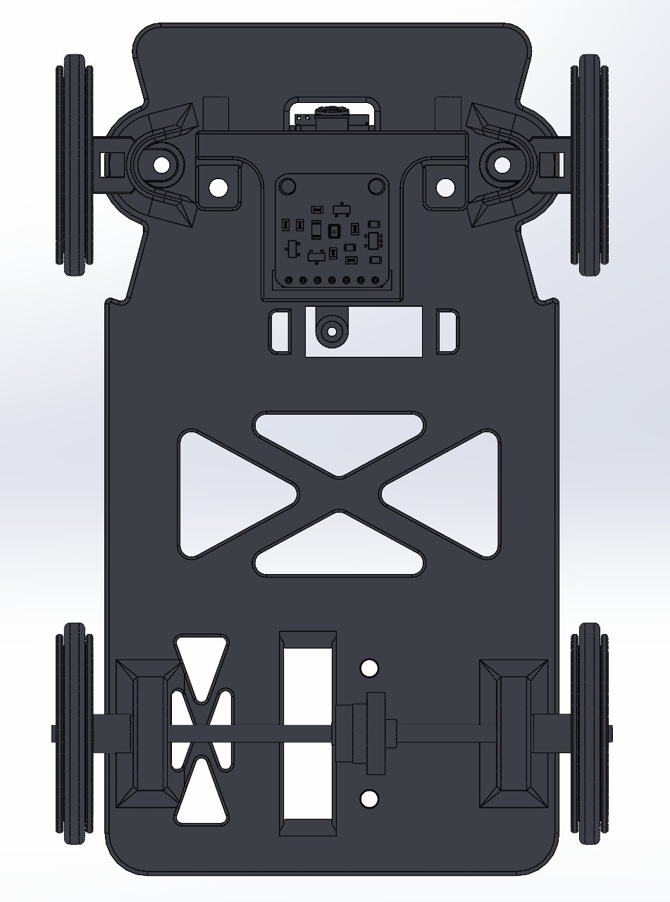

  <em>Left: Full assembly isometric view showing overall vehicle form factor &nbsp;•&nbsp; Right: Top-down view revealing chassis layout, electronics bay, steering geometry, and drivetrain routing</em>

  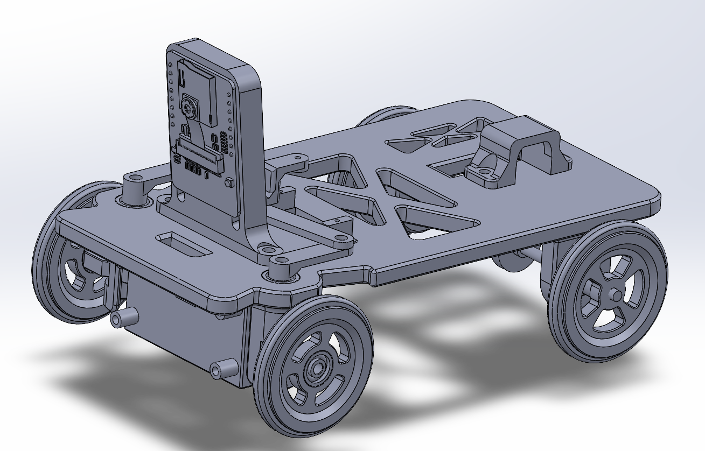

  <em>Secondary isometric angle highlighting camera mount, wheel profile, and chassis depth</em>

## ⚙️ Core Mechanical Systems

### 🏗️ Main Chassis — Ana Gövde

  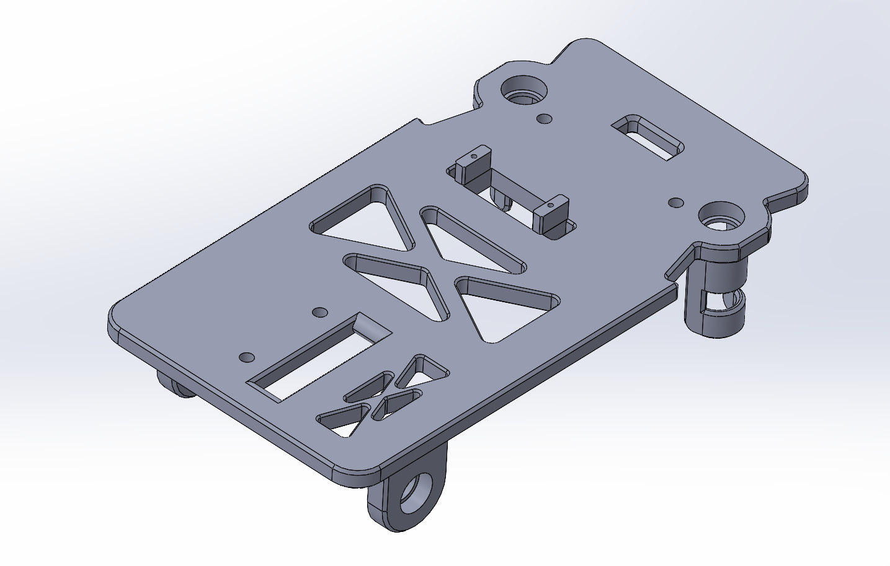

  <em>Primary structural plate featuring X-pattern lightening pockets, integrated standoff posts, and dedicated mounting zones for motor, servo, electronics, and sensor assemblies</em>

**Structural Design Elements:**
- **Flat-Plate Architecture**: Single-level structural platform keeping CG as low as possible for stability at speed
- **X-Pattern Lightening Cutouts**: Triangular pocket geometry maximizes removed mass while preserving structural load paths
- **Integrated Standoff Columns**: Raised posts molded into the chassis for direct PCB and cover mounting without separate hardware
- **Dedicated Subsystem Zones**: Distinct areas pre-allocated for motor mount, servo, differential, and sensor brackets — no retrofitting required
- **Perimeter Mounting Rail**: Continuous edge flange providing multiple attachment points for external brackets and covers

---

### 🔄 Steering System — 4-Part Ackermann Linkage

The front steering system uses a 4-component linkage to achieve Ackermann-compliant geometry, ensuring both front wheels track toward a common turn center during cornering to eliminate tire scrub.

  <table align="center">
    <tr>
      <td align="center">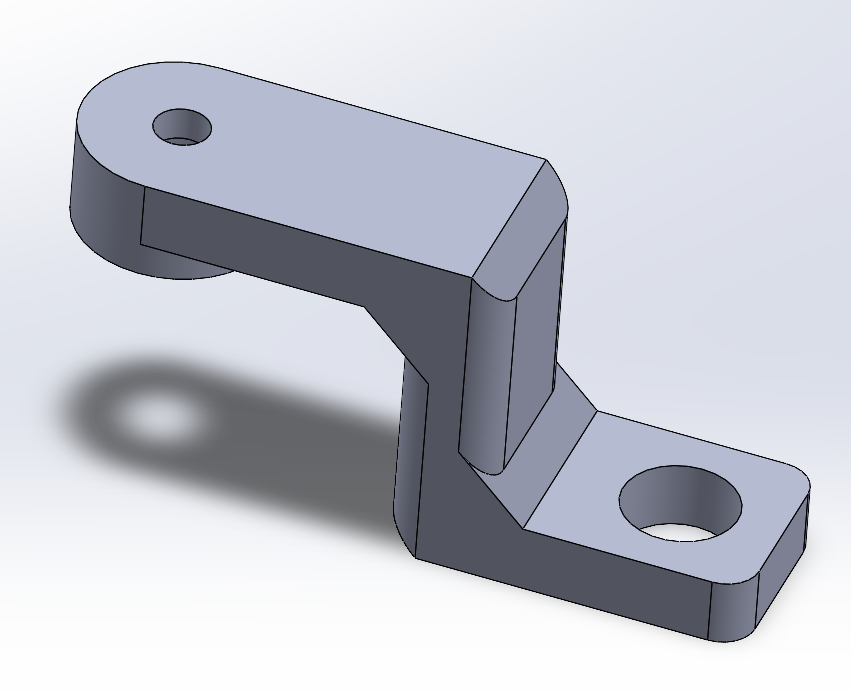 <em>Steer1 — Steering Knuckle</em></td>
      <td align="center">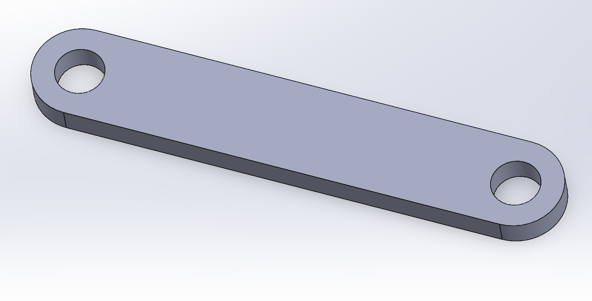 <em>Steer2 — Tie Rod</em></td>
      <td align="center">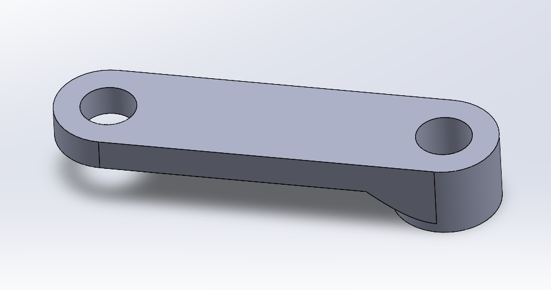 <em>Steer3 — Steering Arm (Left)</em></td>
      <td align="center">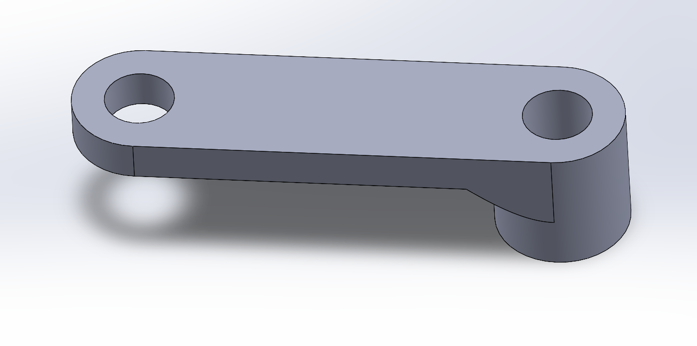 <em>Steer4 — Steering Arm (Right)</em></td>
    </tr>
  </table>

**Component Breakdown:**
| Part | Role | Key Feature |
|------|------|-------------|
| **Steer1** — Steering Knuckle | Connects wheel spindle to chassis upright | L-shaped bracket; upper hole receives servo linkage pin, lower hole bolts to chassis pivot |
| **Steer2** — Tie Rod | Transmits servo motion to wheel knuckles | Flat bar with equal-diameter holes at each end for precise, backlash-free length |
| **Steer3** — Left Steering Arm | Translates servo rotation to wheel angle | Asymmetric arm with offset boss; asymmetry compensates Ackermann geometry requirement |
| **Steer4** — Right Steering Arm | Mirror function of Steer3 for right wheel | Cylindrical boss on the long end for shaft engagement; geometry mirrored to Steer3 |

**Ackermann Compliance:** The offset geometry of Steer3/Steer4 ensures the inner wheel turns through a greater angle than the outer wheel during cornering, matching the theoretical Ackermann condition for the vehicle's wheelbase and track width.

---

### 🔧 Rear Drivetrain — Differential & Gear System

  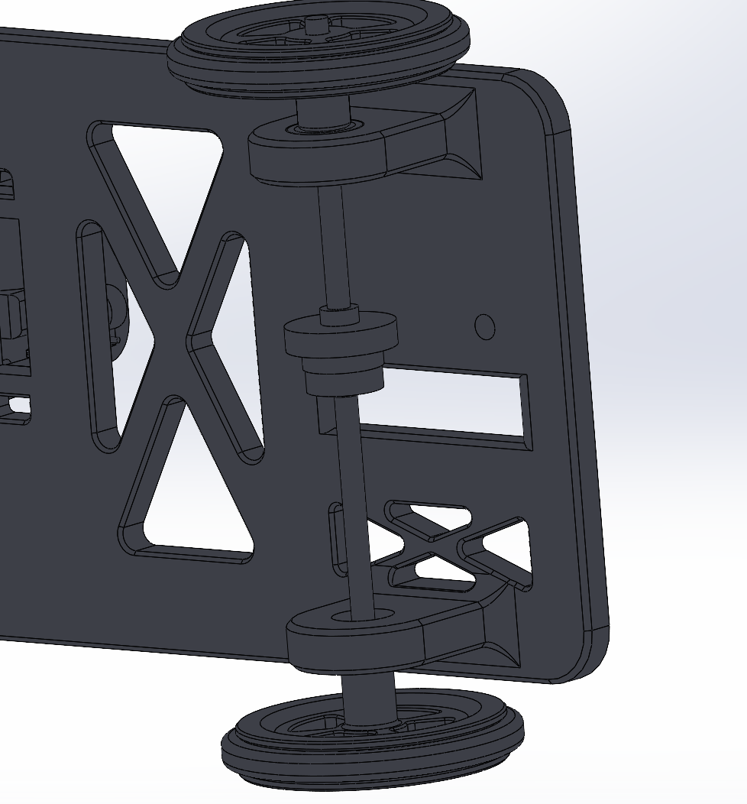

  <em>Assembled differential showing rear shaft, gear stack, and bearing assembly — enables independent rear wheel rotation during turns to prevent inside-wheel scrub</em>

  <table align="center">
    <tr>
      <td align="center">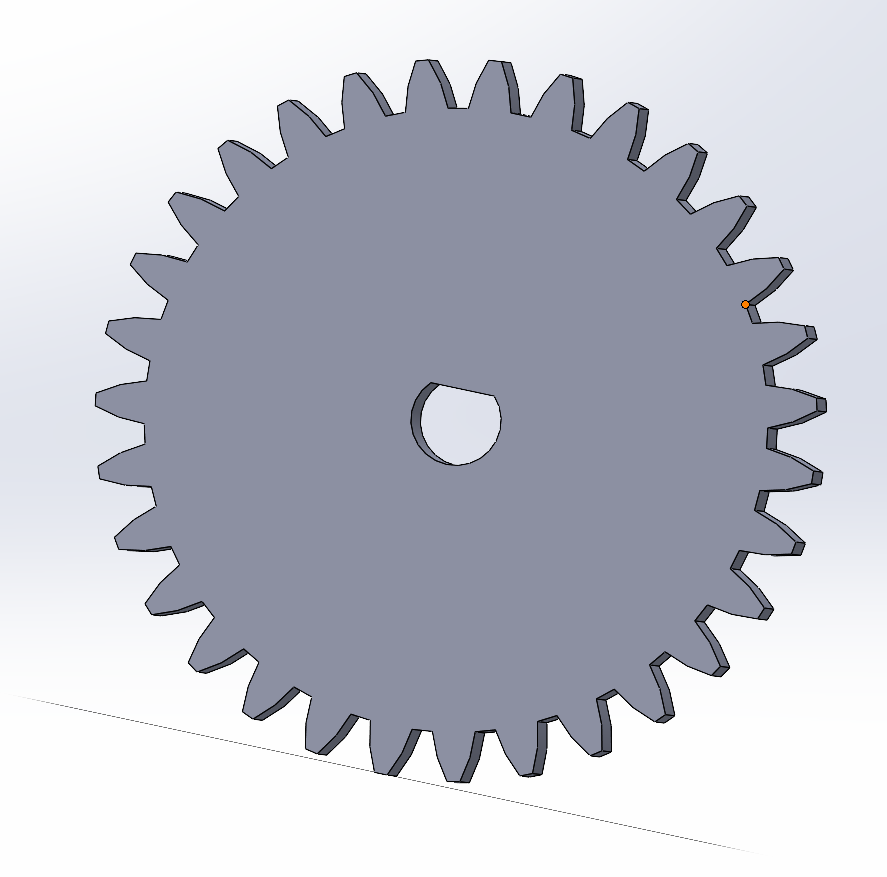 <em>0.8M-31T Motor Gear</em></td>
      <td align="center">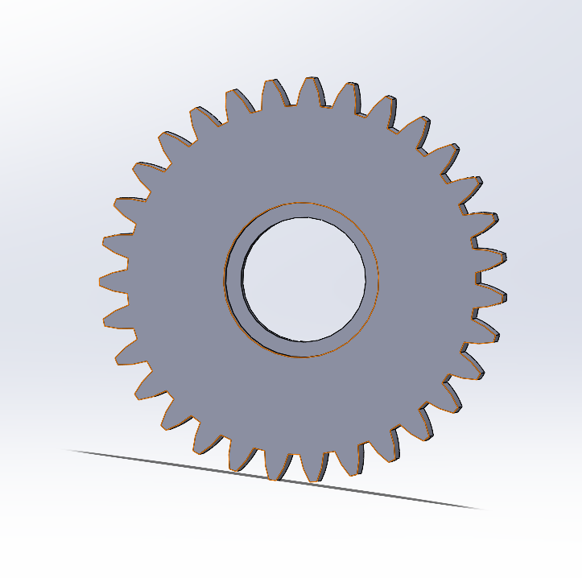 <em>0.8M-31T Driven Gear</em></td>
      <td align="center">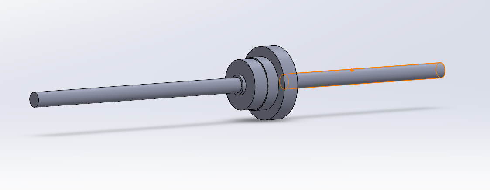 <em>Rear Shaft Assembly</em></td>
    </tr>
  </table>

**Drivetrain Specifications:**
- **Gear Standard**: 0.8 Module spur gears — compact pitch suited for small-scale precision drivetrains
- **Tooth Count**: 31 teeth on both motor pinion and driven gear → **1:1 drive ratio**
- **Design Intent**: The 1:1 ratio preserves full motor RPM, prioritizing speed over additional torque reduction; torque is inherently sufficient at this vehicle mass
- **Motor Gear** (`08M-31T_Motor`): Small central bore sized to press-fit directly onto motor output shaft
- **Driven Gear** (`0.8M-31T`): Large central hub bore for rear shaft engagement, transfers torque into the differential
- **Rear Shaft** (`ArkaŞaft`): Through-axle with integrated differential gear stack and bearing seats at both ends; provides the structural spine of the rear drivetrain

---

### 🏎️ Wheel & Tire System

  <table align="center">
    <tr>
      <td align="center">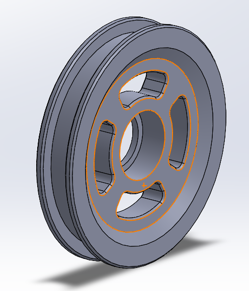 <em>Front Wheel</em></td>
      <td align="center">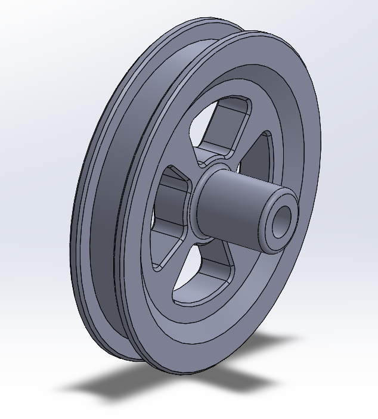 <em>Rear Wheel</em></td>
      <td align="center">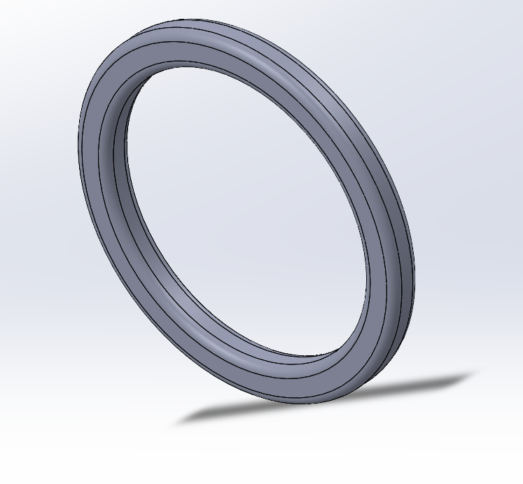 <em>Custom Tire (O-ring)</em></td>
    </tr>
  </table>

**Wheel Design Differences:**

| Aspect | Front Wheel | Rear Wheel |
|--------|-------------|------------|
| **Hub Type** | Recessed bearing seat (press-fit 3×10×4 bearing) | Direct shaft hub — no separate bearing |
| **Spoke Pattern** | 4 cut-out spokes with intermediate web | 4 solid spokes, lighter construction |
| **Steering Compatibility** | Rotates freely around fixed spindle via bearing | Fixed to rear axle shaft, driven rotationally |
| **Rim Profile** | Wide rim flange for tire retention under steering loads | Standard rim flange |

**Tire Design:**
- **Form**: O-ring style — a circular torus profile that press-fits over the outer rim flange
- **Surface**: Three parallel circumferential grooves on the outer face providing predictable traction and consistent rolling contact patch
- **Material**: Flexible rubber/TPU compound allowing elastic stretch during fitting and conforming contact with the track surface
- **Advantage**: Simple replacement without tools; consistent geometry batch-to-batch

---

### 📐 Sensor & Electronics Mounts

  <table align="center">
    <tr>
      <td align="center">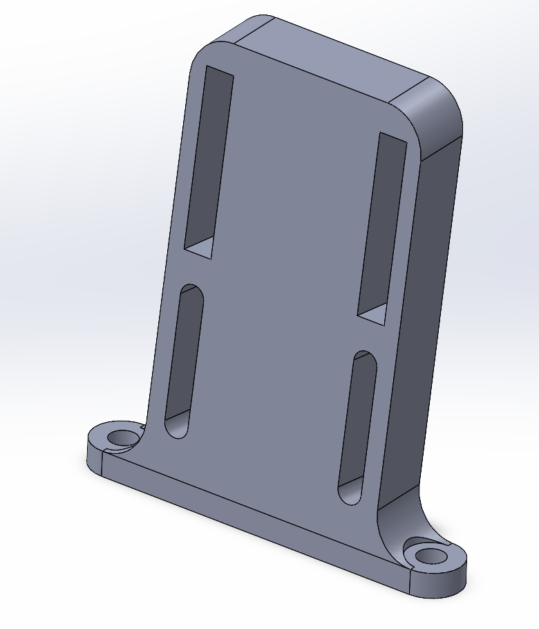 <em>Camera Mount</em></td>
      <td align="center">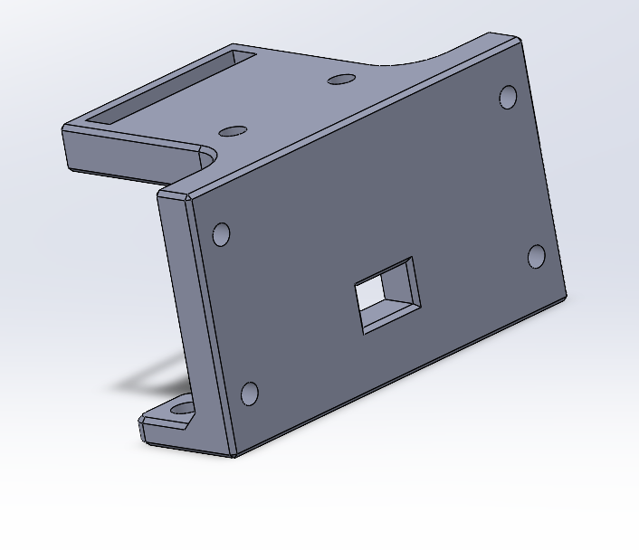 <em>US-100 Ultrasonic Mount</em></td>
    </tr>
  </table>

**Camera Mount (`CamMount`):**
- Tall vertical bracket providing elevated camera positioning for wider field-of-view coverage of the competition field
- Two vertical adjustment slots allow height fine-tuning without reprinting — camera can slide and lock at the optimal angle
- Two M3 mounting holes at the base for rigid chassis attachment
- Angled forward lean designed to aim the camera slightly downward for near-field obstacle detection

**US-100 Ultrasonic Mount (`US100_Mount`):**
- Box-form bracket with square central cutout sized precisely to the US-100 sensor body
- Side snap/clip tab retains the sensor without additional fasteners for quick swap during competition
- Four corner mounting holes for secure chassis attachment
- Compact profile minimizes aerodynamic interference and weight at the front/rear of the vehicle

---

### 🔩 Motor Mount

  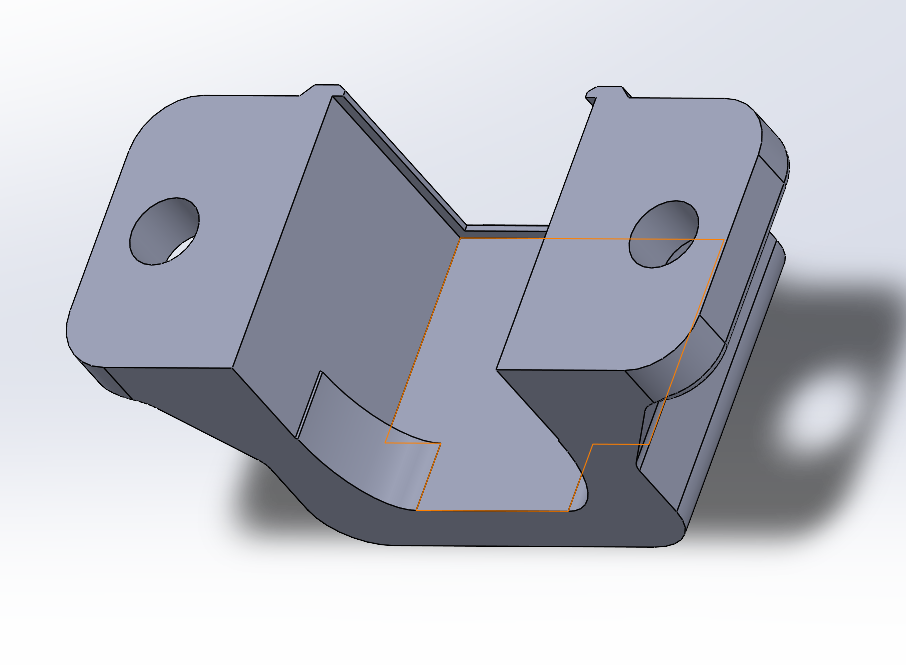

  <em>U-bracket motor mount with snap-fit clamp for DC motor body and two M3 bolt holes for chassis attachment</em>

- **U-Bracket Form**: Wraps around the motor body providing support on three sides against vibration and torque reaction
- **Snap Clip**: One side features a flexible retention tab that snaps over the motor body for tool-free field replacement
- **Dual Mounting Holes**: Two M3 holes on the base flange provide rigid, over-constrained attachment to the chassis to prevent any rocking under drive load
- **Gear Alignment**: Mount geometry positions the motor output shaft at the exact center distance required for 0.8M gear mesh with zero adjustment needed

---

### 🛞 Front Wheel Mount

  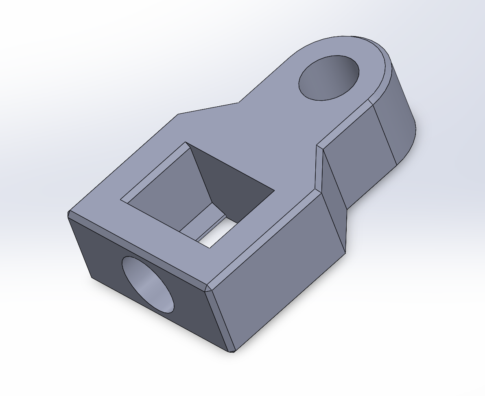

  <em>Front wheel upright with square steering pin slot, bearing bore, and dual attachment holes connecting the steering linkage to the wheel spindle</em>

- **Square Slot**: Receives the servo/steering pin ensuring zero rotational slip between steering command and wheel response
- **Bearing Bore**: Precision-sized pocket for 3×10×4 bearing press-fit, providing a smooth low-friction pivot axis for the front wheel
- **Dual Hole Attachment**: Two mounting points prevent single-point failure and provide the moment arm needed to resist steering loads

---

## 🔩 Hardware Components

  <table align="center">
    <tr>
      <td align="center">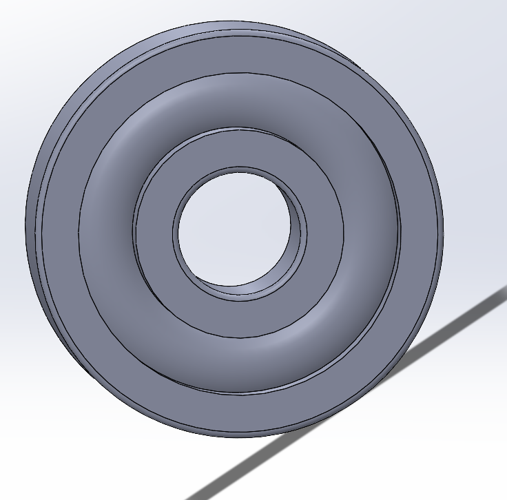 <em>3×10×4 Bearing</em></td>
      <td align="center">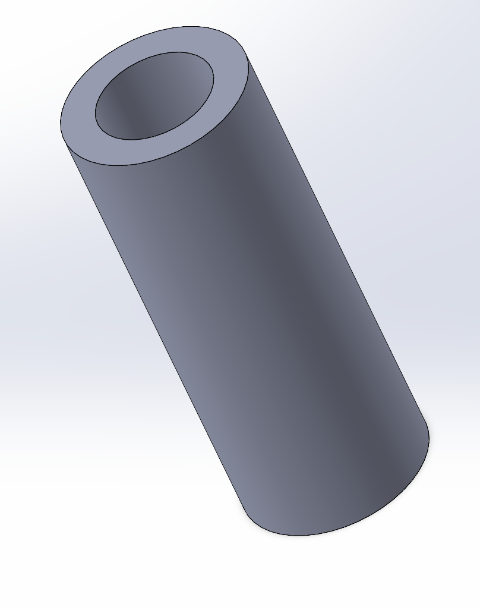 <em>Spacer (Thin)</em></td>
      <td align="center">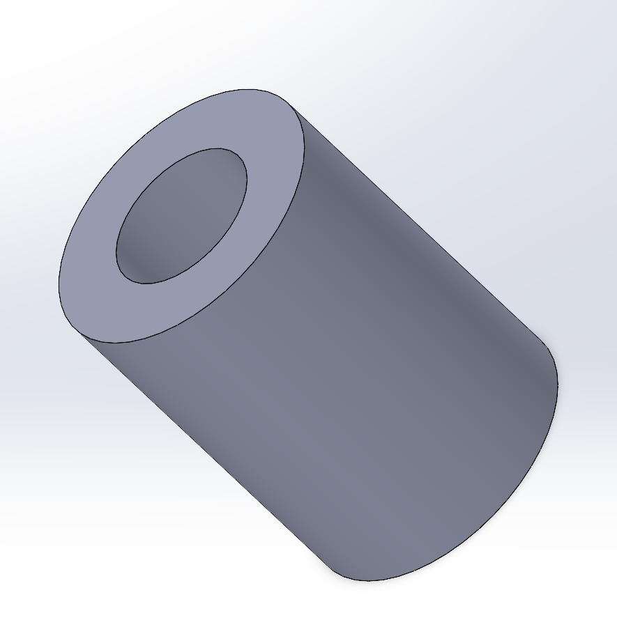 <em>Spacer (Thick)</em></td>
      <td align="center">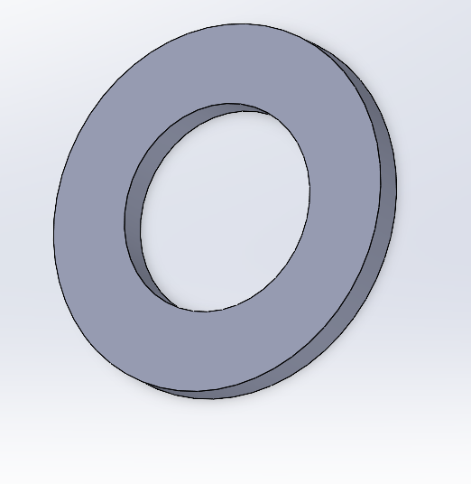 <em>M3 Washer</em></td>
    </tr>
  </table>

| Component | Specification | Purpose |
|-----------|---------------|---------|
| **3×10×4 Bearing** | ID: 3mm, OD: 10mm, Width: 4mm | Front wheel spindle rotation; rear shaft support; eliminates friction at high-load rotating joints |
| **Spacer (İnce)** | Hollow cylinder, small length | Axial positioning of gears and wheels on shaft; prevents lateral play without adding excess mass |
| **Spacer (Kalın)** | Hollow cylinder, greater length | Wider axial gaps between components; used where gear or bearing stack-up requires longer standoff |
| **M3 Washer (Pul)** | M3 standard flat washer | Load distribution under bolt heads and nuts; prevents fastener pull-through in printed parts |

---

## 📁 3D Model File Index

All models were designed in **SolidWorks** and are documented here as PNG render previews. The table below lists every custom-printed or custom-modeled component in the vehicle assembly.

*Quantities listed are for one complete vehicle*

| Component | Preview | Qty | Description |
|-----------|---------|-----|-------------|
| **Ana Gövde** (Main Chassis) |  | 1 | Primary structural plate with X lightening pockets and integrated mounting zones |
| **Motor Mount** |  | 1 | U-bracket with snap clamp for DC motor, two M3 base holes |
| **Front Wheel Mount** |  | 2 | Wheel upright with bearing bore and square steering pin slot (left/right) |
| **Steer1 — Steering Knuckle** |  | 2 | L-shaped knuckle connecting wheel to chassis pivot (left/right) |
| **Steer2 — Tie Rod** |  | 1 | Flat link bar transmitting servo motion to front knuckles |
| **Steer3 — Left Steering Arm** |  | 1 | Asymmetric arm with Ackermann offset, left side |
| **Steer4 — Right Steering Arm** |  | 1 | Mirror of Steer3 with cylindrical boss for shaft, right side |
| **Front Wheel** |  | 2 | 4-spoke rim with recessed 3×10×4 bearing seat |
| **Rear Wheel** |  | 2 | 4-spoke rim with direct shaft hub, no bearing |
| **Tire** |  | 4 | O-ring torus tire with 3 circumferential grip grooves |
| **0.8M-31T Driven Gear** |  | 1 | 31-tooth 0.8M spur gear with large hub bore for rear shaft |
| **0.8M-31T Motor Gear** |  | 1 | 31-tooth 0.8M spur gear with small bore for motor output shaft |
| **Arka Şaft** (Rear Shaft) |  | 1 | Rear through-axle with differential gear stack and bearing seats |
| **Assembled Differential** |  | 1 | Complete differential sub-assembly reference view |
| **Camera Mount** |  | 1 | Tall vertical bracket with dual adjustment slots for camera height |
| **US-100 Mount** |  | 1 | Box bracket with square sensor cutout and snap-clip retention |
| **Spacer (İnce)** |  | TBD | Short hollow spacer for axial component positioning |
| **Spacer (Kalın)** |  | TBD | Tall hollow spacer for wider axial gaps |
| **3×10×4 Bearing** |  | 4+ | Radial ball bearing for front wheel spindles and shaft support |
| **M3 Washer** |  | TBD | Standard flat washer for M3 fasteners |

---

## 🏭 Design & Manufacturing

### 🖥️ CAD Platform
All components were modeled in **SolidWorks** with full parametric feature trees, enabling rapid design iteration and precise dimension control. Assembly files validate fit, clearance, and motion range before any part is printed.

### 🖨️ 3D Printing Strategy
- **Target Material**: PLA for initial prototyping; ABS or PETG for competition parts requiring impact resistance and thermal stability
- **Gear Infill**: 100% for all gear components to prevent tooth deformation under repeated meshing load
- **Structural Parts**: 40–60% infill with rectilinear or gyroid pattern for chassis, mounts, and brackets
- **Bearing Seats**: Printed at 0.08–0.1mm layer height for dimensional accuracy required for press-fit bearing installation
- **Orientation**: Parts oriented to place layer lines perpendicular to primary stress direction, maximizing inter-layer tensile strength where needed

### 🔄 Design Iteration Process
1. **Conceptual Layout** — Component placement defined in assembly sketch to lock wheelbase, track width, and sensor positions
2. **Individual Part Modeling** — Each component modeled parametrically with design intent captured in feature names and equations
3. **Assembly Validation** — Full assembly checked for interference, range-of-motion clearances, and cable routing paths
4. **Prototype & Test** — First-print fit check, steering geometry validation, and drivetrain engagement verification
5. **Refinement** — Dimensional corrections, wall thickness optimization, and fastener clearance adjustments applied before production prints

---

## 🧩 Assembly Guide

### Phase 1: Rear Drivetrain
1. Press 3×10×4 bearings into rear shaft bearing seats
2. Slide driven gear (`0.8M-31T`) onto rear shaft and secure axially with thin spacers
3. Mount motor onto `motorMount` bracket; press motor gear (`08M-31T_Motor`) onto motor output shaft
4. Bolt `motorMount` assembly to chassis — verify gear mesh engagement and backlash
5. Install rear wheels onto shaft ends, securing with washers and locking fasteners

### Phase 2: Front Steering System
1. Press 3×10×4 bearings into `Front_Wheel_Mount` bearing bores
2. Install `Steer1` knuckles into chassis front pivot points
3. Connect `Steer3` and `Steer4` arms to servo output horn and knuckle pins respectively
4. Thread `Steer2` tie rod between knuckle connection points; adjust length for zero toe-in at center
5. Install front wheels onto spindles through bearing bores; verify free rotation with no lateral play

### Phase 3: Sensor & Electronics Integration
1. Bolt `CamMount` to designated chassis standoff holes; slide camera module into slots, set height, tighten
2. Snap US-100 sensor into `US100_Mount` bracket; bolt bracket to front chassis face
3. Install PCB/controller into electronics bay using chassis integrated standoffs
4. Route all wiring through chassis cable channels away from moving drivetrain components

---

## ✅ Validation Checklist

- **Steering Range**: Confirm full left-to-right servo travel translates to expected wheel deflection angles without binding
- **Differential Function**: With rear wheels off ground, verify each rear wheel can rotate independently while the other is held
- **Gear Mesh**: No noise or skip at full motor speed; correct backlash (0.1–0.2mm) between 0.8M gears
- **Bearing Seating**: All bearings fully seated, no axial float, smooth rotation under light finger pressure
- **Sensor Alignment**: Camera FOV centered on track ahead; US-100 sensors aimed level and perpendicular to travel direction
- **Fastener Torque**: All M3 bolts confirmed snug; locking elements (nyloc or threadlocker) applied to high-vibration joints

---

For electrical systems documentation: [Schemes Documentation](../schemes/README.md)  
For software implementation and algorithms: [Software Documentation](../src/README.md)  
For performance demonstrations: [Video Documentation](../video/README.md)  
For additional resources and photos: [Other Documentation](../other/README.md)
