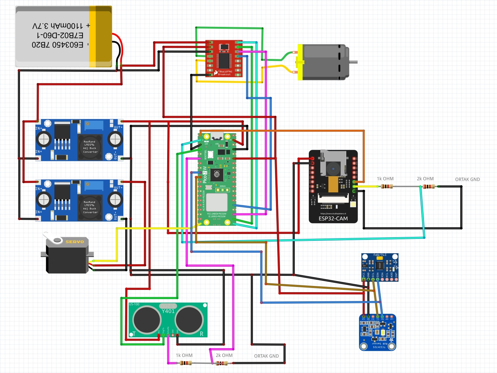
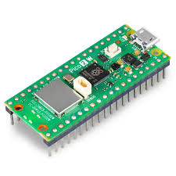
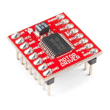
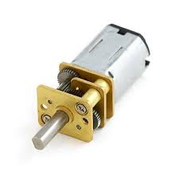
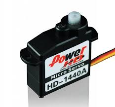
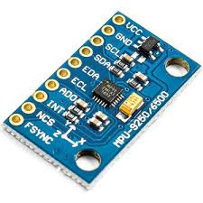
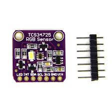
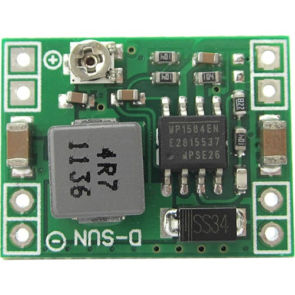
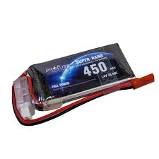
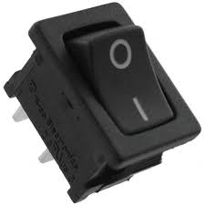

# Electronics Schemes

This directory documents the electronics used in the WRO 2026 Future Engineers robot. It includes the complete wiring scheme and a bill of materials for the main controller, sensors, motor driver, power system, drive motor, and steering servo.

## Main Wiring Scheme

The wiring scheme is built around a Raspberry Pi Pico 2 W H controller. The Pico controls the motor driver, steering servo, US-100 ultrasonic sensor, MPU9250 IMU, and TCS34725 color sensor. The ESP32-CAM works as a separate vision module and sends camera detections to the Pico over UART.

## Complete Bill of Materials (BOM)

| Component | Image | Quantity | Type | Description |
| --- | --- | ---: | --- | --- |
| Raspberry Pi Pico 2 W H |  | 1 | Main microcontroller | Runs the MicroPython control code for steering, motor control, sensor reading, open round, and obstacle round behavior. |
| ESP32-CAM |  | 1 | Camera module | Detects red and green obstacles and sends compact UART messages to the Pico. |
| TB6612FNG |  | 1 | Motor driver | Drives the 6 V DC motor using PWM and direction signals from the Pico. |
| 6 V micro DC motor |  | 1 | Drive motor | Provides propulsion for the vehicle through the drivetrain. |
| HD-1440A servo |  | 1 | Steering servo | Controls the steering mechanism and receives PWM commands from the Pico. |
| US-100 ultrasonic sensor |  | 1 | Distance sensor | Measures front distance for wall detection, corner detection, and safety checks. |
| MPU9250 |  | 1 | IMU / gyro sensor | Provides yaw-rate data for heading correction, 90-degree turns, and recovery after obstacle passing. |
| TCS34725 |  | 1 | Color sensor | Reference/backup color sensing module for future color-based improvements. |
| LM2596 / RT3505 buck converter |  | 2 | Voltage regulator | Steps battery voltage down for electronics and actuator rails. Output voltage must be checked before connecting modules. |
| 6S 450 mAh LiPo battery |  | 1 | Battery | Main robot power source. Feeds the regulator stage through the main switch. |
| On/off switch |  | 1 | Power switch | Enables safe manual power control for the robot. |

## Signal and Power Summary

| Connection group | Modules | Notes |
| --- | --- | --- |
| Motor control | Pico 2 W H -> TB6612FNG -> DC motor | PWM controls speed, direction pins control motor direction. |
| Steering | Pico 2 W H -> HD-1440A servo | Servo limits are tuned in `src/servo_tune.py`. |
| Distance sensing | Pico 2 W H -> US-100 | Used by `src/openround.py` and `src/obstacleround.py` for wall/corner detection. |
| Gyro heading | Pico 2 W H -> MPU9250 | I2C gyro data is used for yaw estimation and turn completion. |
| Camera UART | ESP32-CAM -> Pico 2 W H | The camera sends `RED`, `GREEN`, or `NONE` messages for obstacle logic. |
| Color sensing | Pico 2 W H -> TCS34725 | Reserved as an extra color sensing module. |
| Power regulation | LiPo -> switch -> buck converters -> modules | All grounds must be common. Regulator outputs must be measured before testing. |

## Safety Checklist

- Check every buck converter output with a multimeter before connecting electronics.
- Keep the Pico, ESP32-CAM, motor driver, sensors, and power system on a common ground.
- Confirm UART TX/RX wiring direction between the ESP32-CAM and Pico.
- Confirm the US-100 echo signal is safe for Pico input voltage.
- Test the servo direction before running autonomous code.
- Test motor direction with wheels lifted from the ground.
- Secure the LiPo battery physically before driving.
- Use the switch to cut power quickly during bench tests.

## Software Mapping

| Software file | Electronics used |
| --- | --- |
| `src/camera.cpp` | ESP32-CAM |
| `src/camera_uart_blink.py` | ESP32-CAM UART output and Pico onboard LED |
| `src/openround.py` | Pico, servo, TB6612FNG, DC motor, US-100, MPU9250 |
| `src/obstacleround.py` | Pico, ESP32-CAM, servo, TB6612FNG, DC motor, US-100, MPU9250 |
| `src/servo_tune.py` | Pico, steering servo, MPU9250 |

This folder should be updated whenever the electronics layout, wiring, power system, or sensor placement changes.
